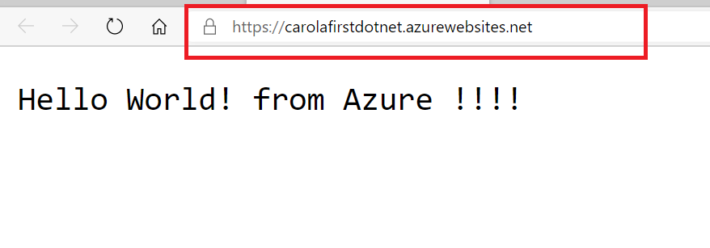
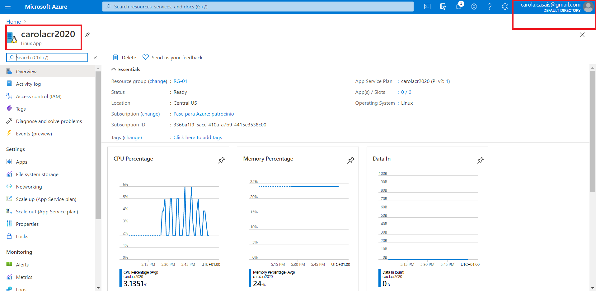

# Exploring-the-Microsoft-Azure-Portal

1. **Nombres y apellidos:** Carola Casais Recondo 
2. **Fecha:** Miércoles 16 de diciembre de 2020
3. **Resumen del Ejercicio:** El objetivo es explorar el portal de Azure, crear una aplicació Linux y realizar una modificación en la misma a través de visual studio code.
4. **Dificultad o problemas presentados y como se resolvieron:** No hubo dificultades.
